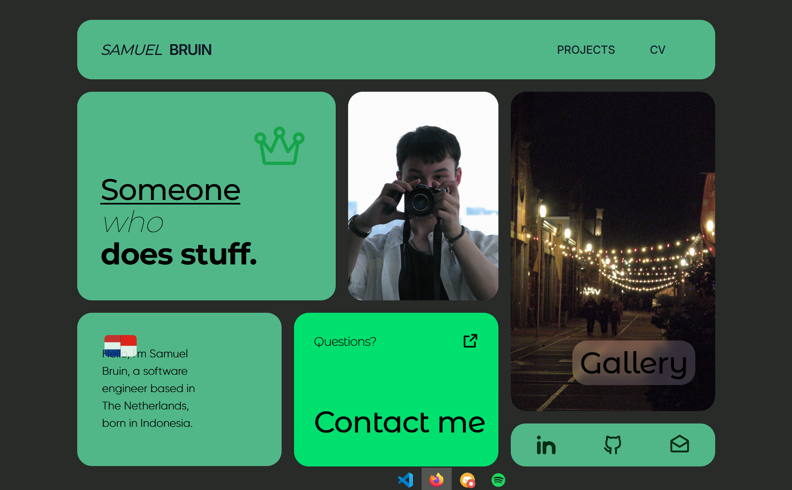

# Portfolio | Samuel Bruin

Welcome to my personal portfolio repository! This project showcases my skills, projects, and professional journey in web development and design.

 <!-- Update with your live URL -->

## 🛠 Technologies Used

- HTML5 & CSS3 (Flexbox/Grid)
- [Sveltekit](https://kit.svelte.dev/) for the frontend
- [Sass](https://sass-lang.com/) for styling
- [Three.js](https://threejs.org/) for 3D elements
